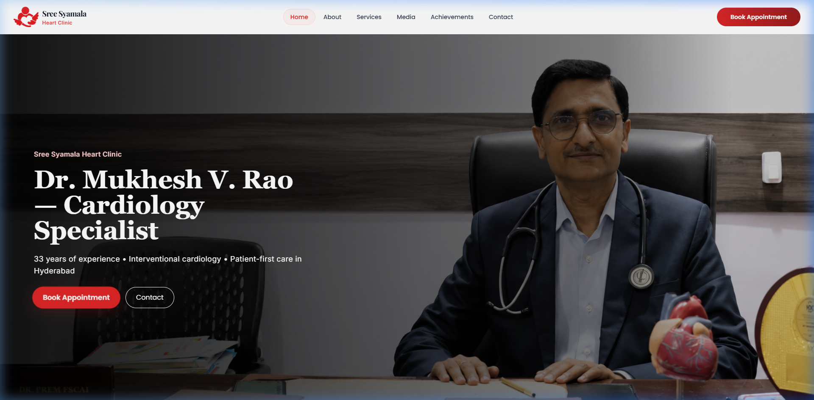
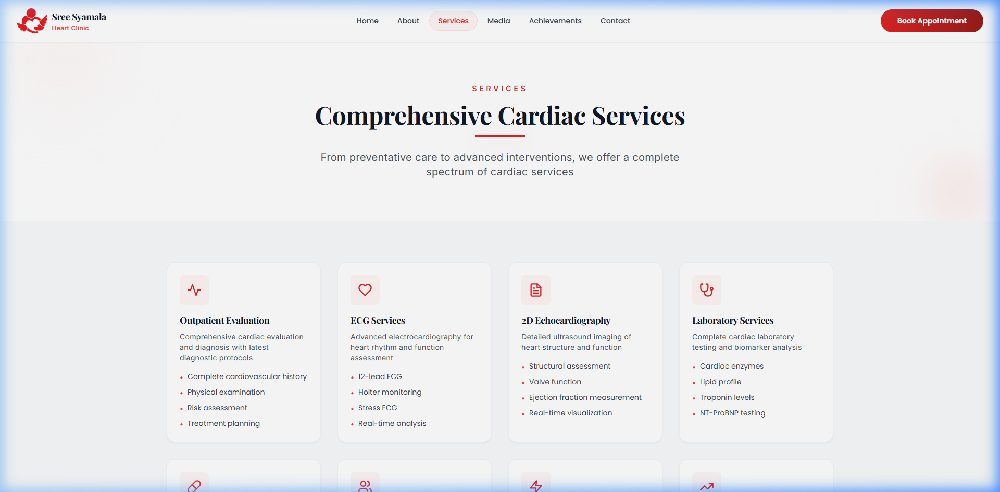
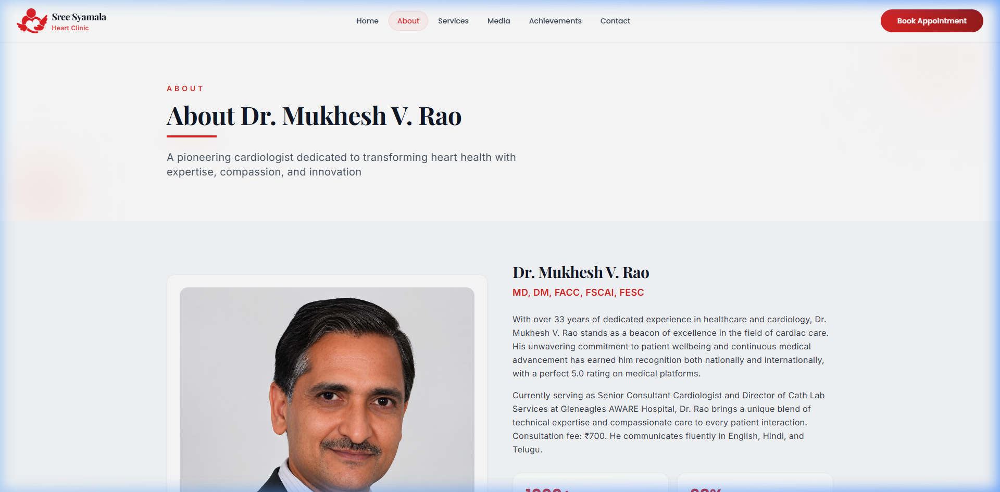
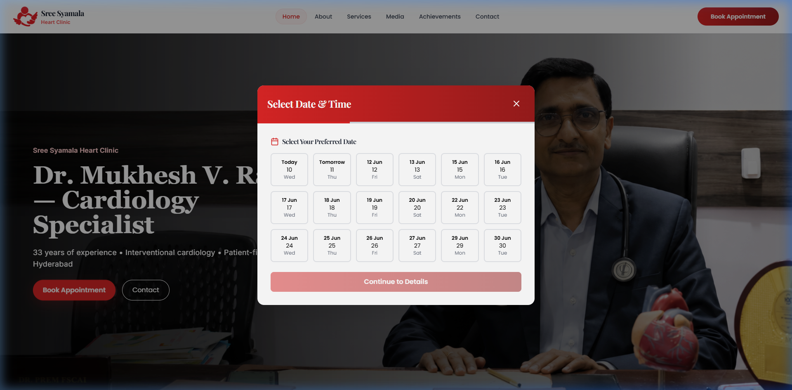
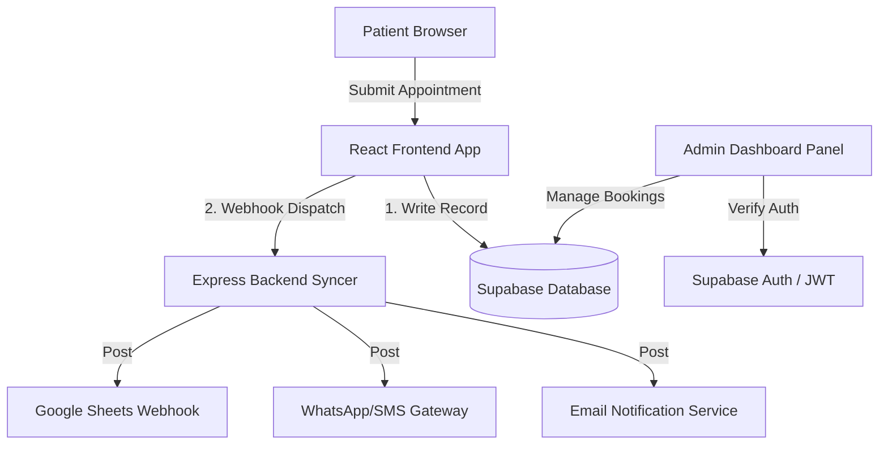

# Modern Cardiology Clinic Website & Booking Platform

A high-performance, responsive, and secure web application and administrative ecosystem designed for a cardiology clinic. Built with React 18, Vite, Tailwind CSS, Node.js Express, and Supabase.

This showcase repository demonstrates the project structure, architectural choices, and design aesthetics of the complete patient-facing clinic website and its corresponding administration portal, without exposing private patient records, database credentials, or proprietary business details.

---

## 📸 Interface Showcase

Below are actual screenshots of the application's user interface showing the modern, premium aesthetic (utilizing HSL-tailored colors, elegant fonts, and soft gradients):

### 1. Landing Page (Hero Section)


### 2. Services Showcase


### 3. Patient About & Experience Page


### 4. Interactive Appointment Booking Modal


---

## 🛠️ Technology Stack & System Architecture

The project is structured into three primary decoupled tiers:

1. **Patient-Facing Client App (React + Vite)**: 
   - Uses **Vite** for sub-second hot module reloading (HMR) and optimized build bundles.
   - Styled with **Tailwind CSS** using a curated dark-red and white color scheme, custom premium typography (Playfair Display + Poppins + Inter), and custom micro-animations (e.g. cardiac pulse graph trackers, smooth fade-in-up entries).
   - Core date calculations and scheduling validation powered by **date-fns**.

2. **Secure Administrative Portal**:
   - Integrated with **Supabase Authentication (JWT)** and **PostgreSQL Row-Level Security (RLS)**.
   - Permits administrative staff to view incoming bookings, update appointment statuses, write patient notes, and manage records in real time.

3. **Backend Syncer & Webhook Integrations (Node.js + Express)**:
   - Synchronizes incoming appointments with secondary datastores.
   - Logs operations and dispatches webhooks to external channels (e.g. Email notifications, WhatsApp/SMS confirmations, Google Sheets logging).

### System Data Flow Architecture



---

## 📂 Codebase Directory Outline

```
clinic-website-showcase/
├── admin/                         # Administrative Panel skeleton
│   └── README.md                  # Admin features, guards, and realtime setup
├── backend/                       # Express integration server
│   └── server.js                  # Routing, webhook dispatches, local file backups
├── screenshots/                   # Production-captured interface graphics
│   ├── home_page.png
│   ├── services_page.png
│   ├── about_page.png
│   └── appointment_modal.png
├── src/                           # Frontend React source code
│   ├── components/
│   │   ├── AppointmentModal.jsx   # Multi-step slot calendar booking modal
│   │   ├── Header.jsx             # Fixed responsive navigation header
│   │   ├── Footer.jsx             # Site footers & contact linkages
│   │   └── Reveal.jsx             # Intersection Observer scroll reveal helper
│   ├── lib/
│   │   ├── bookingService.js      # Decoupled database insertions & API calls
│   │   └── supabaseClient.js      # Supabase JavaScript client initializer
│   ├── pages/
│   │   ├── Home.jsx               # Landing page with stats and services
│   │   ├── About.jsx              # Credentials, certifications, and background
│   │   ├── Services.jsx           # Cardiology solutions catalogue
│   │   └── Contact.jsx            # Location details and contact information
│   ├── App.jsx                    # Routing configuration and layout shell
│   ├── main.jsx                   # React application entry-point
│   └── index.css                  # Tailwinds base, directives, and custom keyframes
├── .env.example                   # Environment configuration variables template
├── index.html                     # HTML boilerplate and viewport settings
├── package.json                   # Project packages and build scripts
├── postcss.config.js              # CSS post-processing setup
├── tailwind.config.js             # HSL-tailored cardiac colors and style layout config
└── vite.config.js                 # Vite dev-server specifications
```

---

## ⚡ Development Setup

### Prerequisites
- Node.js (version 18 or above)
- npm, yarn, or pnpm

### Step 1: Install Dependencies
Run the installation command in the showcase folder to setup the React compiler environment:
```bash
npm install
```

### Step 2: Configure Environment Variables
Copy `.env.example` to `.env.local` and substitute your database parameters:
```bash
cp .env.example .env.local
```

### Step 3: Run local Dev Server
Start the local server. Vite will host the application at `http://localhost:3000`:
```bash
npm run dev
```
